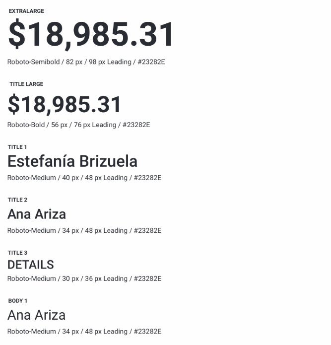
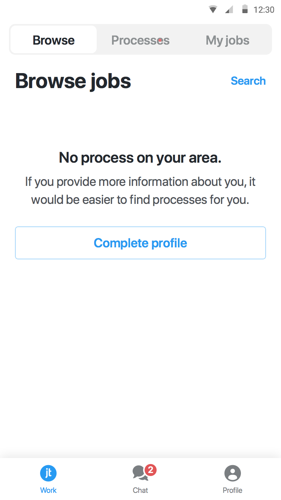
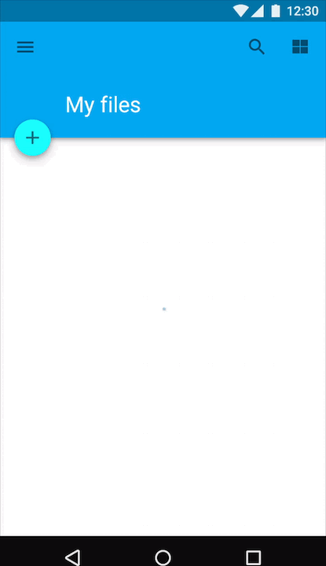

# Design Collaboration Guidelines

As app developers, one of our top priorities should always be to create implementations that match as much as possible the designs. To accomplish this goal, we need to define a standard vocabulary between the design team and us. Designers are, more and more, integrating [design systems][design-systems] as part of their work, and we can benefit from that to build common ground. **Here we define the minimum standard requirements to keep consistency and the usual forgotten pieces of app design.** Independently of the size of your team, there is already a set of best practices applied by your designer that you can benefit, and others you will need anyway at some point while developing the app itself.

## Style guide - Foundation
These are the basic styles that will serve as the foundation of all the other part of the design. The style guide will be helpful to avoid the mistake of not using the proper element as part of the application UI. Regardless if you follow material design, fluent design or any other design system, these style elements will facilitate tasks such as design adjustment and rebranding.

### Color Palette
A list of all the color used in the app with their name associated. Tools exists [native][asset-catalog-colors] or [custom][swiftgen] for in iOS and [Android][android-resources-color] to transform color palettes and become part of your code.

|  |
|:--:|
| [jobandtalent VisualKit palette](https://jobandtalent.engineering/visualkit-ui-framework-74ab8aae0d42) |

### Typography - Fonts
A list of all the fonts and sizes used in the app. When possible, a complete style guide should also include colors and formatting(bold, italic, alignment) of each font.

|  |
|:--:|
| [jobandtalent VisualKit fonts](https://jobandtalent.engineering/visualkit-ui-framework-74ab8aae0d42) |

## Layout

### Sizing and Spacing
Base templates of every screen should be based o most commonly used devices that respect ratio and size. And a general rule for padding or margin that you can apply to most, if not all, of the app screens, include general rules when spacing values are constant (e.g., 8dp) or if elements have to be centered or positioned relative to other views.

### Size Classes - Responsive UI
Interface elements and layouts can be configured to automatically change shape and size on different devices, during multitasking on a tablet, in split view, when the screen is rotated, and more. You will find various strategy depending on the platform as [device size classes][adaptivity-layout] in iOS and [responsive UI][responsive-ui] in Android.

## Components - Pattern library - Atoms
Different design systems will have different naming for it, in [atomic design][atomic-design] you will call this Atoms, in others, it's just called pattern library, or components. All these building blocks should be based on the style guide and will be used to build more complex elements of user interface like pages and screens.

Commons components you can find in most applications are:
* Labels
* Inputs
* Buttons

### Animations
Views can contain animations they are generally under two categories, animated views or animated assets.

Animated views allow in general the following change of properties as animation point:

* Size
* Position
* Transform: scale, rotate, or translate
* Color and transparency

Animated assets are used for custom loaders, visual description of first use or empty case. They are defined with a motion graphic tool like Adobe After Effects and integrated into the app with a framework like [Lottie][lottie].

## Interaction Model - Patterns

### Navigation
As today most of the mobile apps are single window full-screen design, in collaboration with the designer, it's essential to review a prototype of the navigation with the design of the App using tools like Marvel or InVision.

There are mainly two ways to navigate from one screen to another:

* Stack: You will find this concept under Navigation Stack or Back Stack under the respective platform. You can quickly identify these screen through the fact that they have a Back/Up Button on the top left Corner.
Important: Remind UX and Product Owner that navigation from a notification should keep into account the stack designed to get to the desired screen.

* Modal/Dialog, It's a screen that sits on top of the current screen, the user must interact with it before they can return to the previous screen. It should contain text and UI controls focused on a specific task. They inform users about critical information, require users to make decisions, or involve multiple tasks. You could identify them as they have at least a cancel button or a close button.
Important: Remind UX and Product Owner a Modal could not be initial screen as they have a dismiss button.

### Screen transitions
If in the navigation prototype no screen transitions are described, ensure with UX and Product Owner that native screen transitions from the platform will be applied. And if any custom transitions are specified, they should include at least duration and easings curves used.

## Empty States
An essential step while design and estimating how complicated a screen is, is to define its empty states.

### First use
Explain to the user functionality of the app, generally shown the first time that user uses the app, or it can appear until the user makes the first interaction that generates content.

|  |
|:--:|
| [jobandtalent example of first use state](https://jobandtalent.engineering/visualkit-ui-framework-74ab8aae0d42) |

### User Cleared
Shown to the user when he clears the content of the screen.

### Error Cases
Indicate to the user that the App wasn't able to load the content of the page.

|  |
|:--:|
| [jobandtalent example network error](https://jobandtalent.engineering/visualkit-ui-framework-74ab8aae0d42) |

### Placeholder
Placeholder is needed mainly in two cases:

* When displaying images provided from a remote source, if not set yet or while loading.
* Form input fields to describe the expected value.

## Loading cases
While reviewing the UI, let the UX and Product Owner know which interactions with users will load content or perform lengthy data processing operations. Use loading indicators and progress bars to allow the user know your app isn’t stalled and to give them an estimate of how long they’ll be waiting.

A general guideline is to show a loader:
 * When a user interaction blocks the UI, like validating a form through a remote API call.
 * When loading background content could take more than 1 ms

## Assets
All assets of all screens should be provided, through a tool, shared folder or repository. Ensure that you have all the densities corresponding to the platforms that you are developing.

## User Generated Content
Design should provide examples that include user-generated content, that content can come from direct user input or content generated by backend API based on the user's information.

Typical content:

* Long text
* Full name
* Big Number

## Tooling
This guideline does not come with a recommendation of tooling, the ones that we tested and used in projects until now are:

* [Zeplin](https://zeplin.io/)
* [InVision](https://www.invisionapp.com/)
* [Marvel App](https://marvelapp.com/)

## References

* [A Comprehensive guide to design systems by Will Fanguy on December 1, 2017][design-systems]
* [Designing Systems by Brad Frost’s Atomic Design][atomic-design]
* [Size Classes and Core Components at WWDC 2017 - Session 812 - iOS](https://developer.apple.com/videos/play/wwdc2017/812/)
* [Material Design guidelines > Responsive UI][responsive-ui]
* [iOS Human Interface Guidelines > Adaptivity and Layout][adaptivity-layout]
* [SwiftGen Colors by AliSoftware][asset-catalog-colors]
* [Asset catalog colors on Xcode 9 by Zeplin][swiftgen]
* [Android Guide Resources Color][android-resources-color]
* [Material Design guidelines > Color System](https://material.io/guidelines/style/color.html#color-color-system)
* [Best Practices for Modals / Overlays / Dialog Windows by Naema Baskanderi on Mar 20, 2017](https://uxplanet.org/best-practices-for-modals-overlays-dialog-windows-c00c66cddd8c)
* [View Programming Guide for iOS > Animations](https://developer.apple.com/library/content/documentation/WindowsViews/Conceptual/ViewPG_iPhoneOS/AnimatingViews/AnimatingViews.html)
* [Airbnb Design > Lottie][lottie]
* [Designing For The Empty States by Craig Dennis on January 9, 2013](https://tympanus.net/codrops/2013/01/09/designing-for-the-empty-states/)
* [Material Design guidelines > Empty States](https://material.io/guidelines/patterns/empty-states.html)
* [Xcode Asset Catalog Format Reference](https://developer.apple.com/library/content/documentation/Xcode/Reference/xcode_ref-Asset_Catalog_Format/index.html)
* [Android Guide Providing Resources](https://developer.android.com/guide/topics/resources/providing-resources.html)
* [VisualKit: creating a UI Framework by Victor Baro on Apr 10, 2017](https://jobandtalent.engineering/visualkit-ui-framework-74ab8aae0d42)
* [Learning to develop Jobandtalent’s design system for Android by Jorge Rodriguez on Jun 20, 2017](https://jobandtalent.engineering/learning-to-develop-jobandtalents-design-system-for-android-54160a571d7b)

[design-systems]: https://www.invisionapp.com/blog/guide-to-design-systems/
[atomic-design]: http://www.atomicdesign.bradfrost.com/chapter-1/
[asset-catalog-colors]: https://blog.zeplin.io/asset-catalog-colors-on-xcode-9-c4fdccc0381a
[swiftgen]: https://github.com/SwiftGen/SwiftGen#colors
[android-resources-color]: https://developer.android.com/guide/topics/resources/more-resources.html#Color
[adaptivity-layout]: https://developer.apple.com/ios/human-interface-guidelines/visual-design/adaptivity-and-layout/
[responsive-ui]: https://material.io/guidelines/layout/responsive-ui.html
[lottie]: https://airbnb.design/introducing-lottie/
